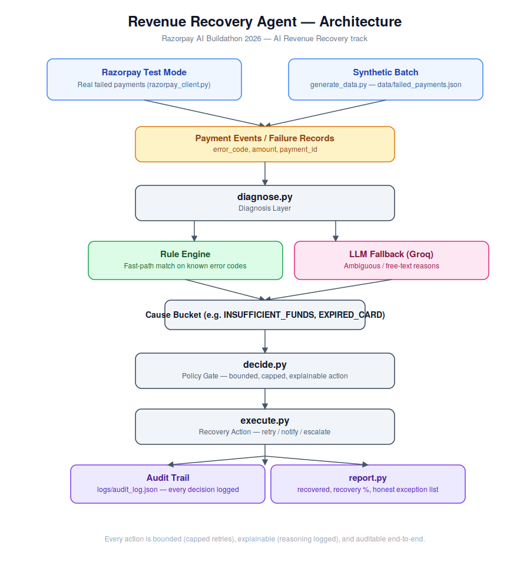

# Revenue Recovery Agent

Built as a submission for **Razorpay's AI Buildathon 2026** — AI Revenue Recovery track.

## Problem

Payments fail for many reasons — declined cards, insufficient funds, expired
cards, bank timeouts — and most of that revenue is never recovered because
there's no system that diagnoses *why* a payment failed and takes a bounded,
appropriate recovery action per cause.

## What this agent does

1. **Ingests** a batch of failed payment records (synthetic data, modeled on
   real-world Razorpay failure reasons).
2. **Diagnoses** the failure cause using a hybrid pipeline: rule-based
   classification for known error codes, Groq LLM fallback for ambiguous or
   free-text failure reasons.
3. **Decides** a bounded recovery action per cause (capped retries, no
   infinite loops — every action is explainable).
4. **Executes** the action via a bounded retry loop (stops on success or
   at the cap, whichever comes first) and logs a full audit trail
   (decision, reasoning, timestamp, outcome) to `logs/audit_log.json`.
5. **Reports** recovery rate, ₹ amount recovered, and an honest list of
   unresolved exceptions — nothing cherry-picked.

## What's real vs. simulated

Being explicit about this, since it matters for judging — and because
recovery figures in this report are reported as two separate numbers
for exactly this reason: **"Revenue Recovered (real, API-confirmed)"
and "Projected Revenue Recovered (simulated outcomes)" are never
blended into a single headline claim.**

- **Real**: Razorpay test-mode payment ingestion (`razorpay_client.py`),
  Groq LLM classification for ambiguous failure reasons, the policy gate
  logic, and — for any record that came from the real Razorpay test
  account specifically — the full retry lifecycle is now a genuine
  asynchronous API flow, not a synchronous guess: a retry order is
  created live (`razorpay_client.attempt_retry`), and the outcome is
  confirmed either by a real, signature-verified Razorpay webhook
  (`agent/webhook_server.py`) or, if no webhook arrives, a polling
  fallback that checks the order's live status directly
  (`agent/reconcile_pending.py`). Nothing about a live record's
  recovered/not-recovered outcome is a probability draw. Occasionally
  the LLM fallback returns `UNKNOWN` when no category fits — this is
  handled explicitly, not treated as an error. Re-running the pipeline
  is safe: `diagnose.py` checks `logs/audit_log.json` and skips any
  payment_id (real or synthetic) already processed in a prior run, so
  the audit trail and reported metrics never double-count a case.
- **Simulated**: for synthetic/demo records specifically (no real prior
  payment exists for these to retry), retry/notify/escalate *outcomes*
  (`SIMULATED_SUCCESS_RATE` in `execute.py`) are still drawn from a
  fixed probability per action type — Razorpay's test mode has no
  endpoint to actually re-attempt a failed payment that never existed
  as a real payment in the first place. `report.py` labels every
  figure derived from these outcomes as **projected**, and reports it
  separately from real, API-confirmed figures. A production
  integration processing real failed payments end-to-end would have no
  simulated bucket at all.

## Architecture



<details>
<summary>Text version</summary>

```
Razorpay test account          data/failed_payments.json
(real failed payments)         (synthetic batch)
        │                              │
        └──────────────┬───────────────┘
                        ▼
        agent/diagnose.py  ──► dedup against logs/audit_log.json
                                (skips already-processed real AND
                                synthetic payment_ids from prior runs)
                        │
                        ▼
        agent/diagnose.py  ──► cause bucket (rule-based → Groq LLM fallback)
                        │
                        ▼
        agent/decide.py    ──► bounded action (retry / notify / escalate)
                                + policy gate (reads current thresholds
                                live from agent/settings_store.py)
                        │
                        ▼
        agent/execute.py   ──► bounded retry loop: up to max_attempts
                                tries, stops the instant one succeeds
                                (real records also get a genuine
                                Razorpay API call to verify live status)
                        │
                        ▼
        agent/execute.py   ──► writes full audit trail to
                                logs/audit_log.json
                        │
                        ▼
        agent/report.py    ──► recovery %, ₹ recovered, exception list
                                → logs/summary_report.json

        agent/settings_store.py (SQLite) ◄──► agent/admin_panel.py
              read on every choose_action() call        (admin edits
                                                          policy live)
```
</details>

## Setup

```powershell
Set-ExecutionPolicy -Scope Process -ExecutionPolicy RemoteSigned
python -m venv venv311
.\venv311\Scripts\Activate.ps1
pip install -r requirements.txt

# Add your Groq API key (get one free at console.groq.com)
Copy-Item .env.example .env
# then edit .env and set GROQ_API_KEY=your_key_here

# Generate a fresh synthetic batch (optional - a sample batch is included)
python scripts/generate_data.py

python app.py
```

## Sample output

`execute.py`'s retry/notify/escalate outcomes for demo/synthetic records
are drawn from a fixed probability, not a seeded RNG, so exact figures
shift slightly from run to run — this is one representative run, not a
fixed guarantee. Real records from a connected Razorpay test account
resolve via a genuine webhook or polled API call instead (see
"What's real vs. simulated" below) — the two are reported as separate
figures, never blended into one "amount recovered" claim.

```
=== Revenue Recovery Report ===
Total failed payments processed: 80
Exceptions (unresolved): 44

Revenue Recovered (real, API-confirmed): ₹0 (no real-resolved cases yet)
Projected Revenue Recovered (simulated outcomes): ₹76,164 (45.0% of 80 simulated cases)

Amount still at risk: ₹148,079

Exceptions by cause:
  EXPIRED_CARD: 11
  BANK_TIMEOUT: 5
  INVALID_CVV: 5
  CARD_DECLINED: 8
  UNKNOWN: 11
  INSUFFICIENT_FUNDS: 4
================================
```

This run had no live Razorpay test-account records mixed in, hence
₹0 real — connect a test account with some real failed payments to see
the real, webhook-confirmed figure populate alongside the projected one.

Full per-record audit trail is written to `logs/audit_log.json`, and the
same summary is written to `logs/summary_report.json`. The JSON also
includes a blended `recovered_amount_blended` figure for convenience,
explicitly labeled as blended — don't cite it as "revenue recovered"
on its own; cite `revenue_recovered_real` and
`projected_revenue_recovered_simulated` separately instead.

## Dynamic Configuration

The two business policy boundaries that most obviously shouldn't
require a code change to adjust — the minimum ₹ amount worth retrying,
and the per-cause retry attempt caps — live in a small SQLite database
(`agent/settings_store.py`) instead of hardcoded constants, and are
editable at runtime through an authenticated admin panel
(`agent/admin_panel.py`).

- **`decide.py` reads both values live on every `choose_action()` call**
  — an admin panel change takes effect on the very next decision, no
  restart or redeploy required.
- **Every change is logged** to `logs/settings_audit_log.json` (who
  changed what, from what value to what value, when) — the same
  audit-trail principle this project already applies to every payment
  decision.
- **Fails safe, not silent**: if the settings DB is ever missing,
  corrupt, or unreadable, every getter falls back to the original
  hardcoded defaults (₹150 minimum; the same per-cause caps as before)
  rather than crashing the pipeline.
- `ACTION_MAP` (which action type a cause maps to) deliberately stays a
  hardcoded constant — it's recovery *logic*, not a tunable threshold.

**Run the panel:**

```powershell
# .env needs ADMIN_USERNAME and ADMIN_PASSWORD set - the panel fails
# closed (401 on every request) if ADMIN_PASSWORD is missing.
python agent/admin_panel.py
# → http://localhost:5001  (HTTP Basic Auth)
```

This is intentionally a lightweight auth scheme (HTTP Basic, not a full
IAM/SSO integration) — for a real deployment, put it behind your cloud
provider's VPN/IAM the same way you would any internal admin tool.

## Containerized Deployment

A `Dockerfile` and `docker-compose.yml` package the whole system —
webhook receiver, admin panel, reconcile loop, and the batch pipeline —
into one image with four different run commands, deployable with one
command to any cloud provider that runs containers (ECS, Cloud Run,
Azure Container Apps, a plain VM with Docker, etc.).

```powershell
Copy-Item .env.example .env
# edit .env: GROQ_API_KEY, RAZORPAY_KEY_ID, RAZORPAY_KEY_SECRET,
# RAZORPAY_WEBHOOK_SECRET, ADMIN_USERNAME, ADMIN_PASSWORD

# Starts the webhook receiver, admin panel, and reconcile loop
docker compose up -d --build

# The batch pipeline is a one-shot script, not a server - run it
# explicitly whenever you want a new batch processed:
docker compose run --rm pipeline
```

| Service     | What it runs                              | Port |
|-------------|--------------------------------------------|------|
| `webhook`   | `agent/webhook_server.py` (via gunicorn)   | 5000 |
| `admin`     | `agent/admin_panel.py` (via gunicorn)      | 5001 |
| `reconcile` | `agent/reconcile_loop.py` (polls forever)  | —    |
| `pipeline`  | `app.py` (one-shot, run on demand)         | —    |

`logs/`, `data/`, and `instance/` (the SQLite settings DB) are all
bind-mounted as volumes, so the audit trail, reports, and policy
settings all persist across container restarts and redeploys — a
`docker compose down && docker compose up -d` does not reset your
policy thresholds or lose your audit history.

## Evaluation

`scripts/generate_eval_data.py` builds a labeled batch stratified into
three buckets so the reported accuracy can't be inflated by trivial
cases: `rule_exact` (a dict-lookup sanity check), `novel_phrasing`
(distinct, non-memorized phrasings of known causes — the real test of
the Groq fallback's language understanding), and `abstention`
(genuinely unclassifiable reasons, `ground_truth = UNKNOWN`, testing
whether the model declines rather than force-fits).

`scripts/evaluate.py` reports each bucket separately and writes a
`headline_ai_accuracy_pct` field to `logs/eval_report.json` — the
`rule_plus_llm` accuracy on `novel_phrasing` only. That's the number to
cite as the LLM fallback's real accuracy; the other numbers in the
report are sanity checks or diagnostics, not capability claims. Run
`python scripts/evaluate.py` with `GROQ_API_KEY` set to regenerate it.

## Testing

```powershell
pip install pytest
pytest tests/ -v
```

Covers the policy gate's core behavior (including that an admin-panel
style settings change takes effect immediately), the classification
layer's rule/LLM/truncated-response/dedup logic, the bounded retry
loop and live/simulated routing in `execute.py`, the pending-retry
store, the webhook receiver's signature verification and idempotency,
and the polling fallback's timeout boundary.

## Status

✅ Core pipeline complete and working end-to-end, including the Groq LLM
fallback for ambiguous failure reasons, dynamic runtime-configurable
policy boundaries, and containerized deployment. Built for the Razorpay
AI Buildathon (deadline: 5 Sept 2026).

## Author

Antonio John — [github.com/antoniojohn](https://github.com/antoniojohn) · [LinkedIn](https://linkedin.com/in/antonio-john-b57014307)
